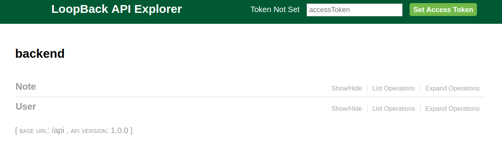

*Step 1* Prepare your environments

- We need a database container.
    - Lets search for mongo

        ```
        docker search mongo
        ```
    - Lets pull mongo
        ```
        docker pull mongo
        ```
    - Lets run the mongo db container
        ```
        docker run -d --name mongodb -p 27017:27017 -e MONGO_INITDB_ROOT_USERNAME=root -e MONGO_INITDB_ROOT_PASSWORD=supersecret mongo
        ```
    - Lets stick to the database name as `appdb`

*Step 2* Build the backend container

- We need to pull the source code from `stage1-build-backend` branch
    - [stage1-build-backend](https://github.com/balaprasanna/docker_k8s_workshop/tree/stage1-build-backend/demo)
    - Lets build the backend api image
        ```
        docker build -t backend:0.0.1 .
        ```

        Expected result
        ```
        $ docker build -t backend:0.0.1 .
        Sending build context to Docker daemon  164.4kB
        Step 1/8 : FROM node
        ---> d888b6980748
        Step 2/8 : WORKDIR /usr/src/app
        ---> Using cache
        ---> 124d7c2b3c22
        Step 3/8 : RUN npm i npm@latest -g
        ---> Running in 8e4ef78bbdba

        /usr/local/bin/npm -> /usr/local/lib/node_modules/npm/bin/npm-cli.js
        /usr/local/bin/npx -> /usr/local/lib/node_modules/npm/bin/npx-cli.js
        + npm@6.1.0
        added 247 packages, removed 41 packages and updated 129 packages in 37.885s
        Removing intermediate container 8e4ef78bbdba
        ---> 9969709c0f4f
        Step 4/8 : COPY package*.json ./
        ---> 6c7fbb951cd9
        Step 5/8 : RUN npm install
        ---> Running in dfc3c6d8a171
        added 475 packages from 430 contributors and audited 2806 packages in 16.538s
        found 7 vulnerabilities (2 low, 4 moderate, 1 high)
        run `npm audit fix` to fix them, or `npm audit` for details
        Removing intermediate container dfc3c6d8a171
        ---> 77dbb58bab3f
        Step 6/8 : COPY . .
        ---> fa05b8b136d0
        Step 7/8 : EXPOSE 3000
        ---> Running in b933cef0edd8
        Removing intermediate container b933cef0edd8
        ---> b9d9f04defeb
        Step 8/8 : CMD [ "npm", "start" ]
        ---> Running in 5aaafd3f25bc
        Removing intermediate container 5aaafd3f25bc
        ---> a2c1ee38c555
        Successfully built a2c1ee38c555
        Successfully tagged backend:0.0.1
        ```

    - Now list all the available images
        - 
        ```
        docker images
        $ docker images
        REPOSITORY             TAG                 IMAGE ID           CREATED             SIZE
        backend                0.0.1               a2c1ee38c555        3 minutes ago       791MB
        ``` 

    - Now lets run this image.
        ```
        docker run --name backend -p 3000:3000 backend:0.0.1
        ```

### Oh no!. We got an error

```
$ docker run --name backend -p 3000:3000 backend:0.0.1

> backend@1.0.0 start /usr/src/app
> node .

Web server listening at: http://localhost:3000
Browse your REST API at http://localhost:3000/explorer
Connection fails: MongoError: failed to connect to server [localhost:27017] on first connect [MongoError: connect ECONNREFUSED 127.0.0.1:27017]
It will be retried for the next request.

/usr/src/app/node_modules/mongodb/lib/mongo_client.js:421
          throw err
          ^
MongoError: failed to connect to server [localhost:27017] on first connect [MongoError: connect ECONNREFUSED 127.0.0.1:27017]
    at Pool.<anonymous> (/usr/src/app/node_modules/mongodb-core/lib/topologies/server.js:336:35)
    at Pool.emit (events.js:180:13)
    at Connection.<anonymous> (/usr/src/app/node_modules/mongodb-core/lib/connection/pool.js:280:12)
    at Object.onceWrapper (events.js:272:13)
    at Connection.emit (events.js:180:13)
    at Socket.<anonymous> (/usr/src/app/node_modules/mongodb-core/lib/connection/connection.js:189:49)
    at Object.onceWrapper (events.js:272:13)
    at Socket.emit (events.js:180:13)
    at emitErrorNT (internal/streams/destroy.js:64:8)

```

## We are unable to connect to the mongodb container

- Discuss the issue
- Plan & solve this issue

## The solution is Docker Networking

- Lets create a network namespace
```
docker network create app_network
```

- Lets stop already running containers

```
docker stop backend
docker stop mongodb
docker rm backend
docker rm mongodb
```

- Lets re-run our containers under the namespace created
`app_network`

```
docker network ls
```
```
$ docker network ls
NETWORK ID          NAME                DRIVER              SCOPE
f5ee60a87290        app_network         bridge              local
51492a4b4179        bridge              bridge              local
f8f2bc4e5123        host                host                local
22806a478f69        none                null                local

```

- Run DB Container 
    ```
    docker run -d --name mongodb --net app_network -p 27017:27017 -e MONGO_INITDB_ROOT_USERNAME=root -e MONGO_INITDB_ROOT_PASSWORD=supersecret -e MONGO_INITDB_DATABASE=appdb mongo
    ```
- Run Backend Container    - 
    ```
    docker run --name backend --net app_network -p 3000:3000 backend:0.0.1
    ```

## Stil we have errors.

This is another good chance to show how to rebuild an image and see how it can build the image much faster than the last time.

## Important Section below !!!
**Fix**
- We can use this image `aashreys/mongo-auth:latest` instead of `official mongo`
- You can reach the container using the name of the container.
- This idea will be carried over to K8S.


Make sure you are in the right directory.
```
docker build -t backend:0.0.2 .
```

**Good to have a look at the difference from perevious stage**


- Lets stop already running containers

```
docker stop backend
docker stop mongodb
docker rm backend
docker rm mongodb
```

#### Run the docker 
```
docker run -d --name mongodb \
--net app_network -p 27017:27017 \
-e AUTH=yes -e MONGODB_ADMIN_USER=admin \
-e MONGODB_ADMIN_PASS=admin \
-e MONGODB_APPLICATION_DATABASE=appdb \
-e MONGODB_APPLICATION_USER=root \
-e MONGODB_APPLICATION_PASS=supersecret \
 aashreys/mongo-auth:latest
```

```
docker run --name backend \
--net app_network \
-d -p 3000:3000 \
backend:0.0.2
```

### WOW. Now we are running two containers.
1. mongo db container to server as a datastore
2. backend container to run the node.js application
3. Both of them are talking to each other in a same network namespace.

### Explore the API here
Go to this url to explore the API
[http://localhost:3000/explorer/#/](http://localhost:3000/explorer/#/)

You will see something like this.
